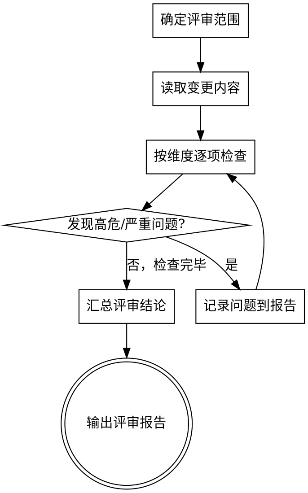

# 代码评审

基于 6 维度 31 项评审标准体系，对代码变更进行系统性评审，输出结构化评审报告。

## 评审流程



## 执行步骤

### 1. 确定评审范围

根据用户输入确定评审对象：

**模式 A：基于 git 提交记录（推荐）**

询问用户选择评审方式：
- **最近一次提交** → 直接使用最新 commit
- **选择历史提交** → 列出最近 10 次提交，让用户选择（支持多选）

使用 `AskUserQuestion` 工具展示提交列表，设置 `multiSelect: true` 支持多选：

```
请选择要评审的提交（已过滤 Merge 提交，仅展示实质变更）：

  1. #2 d1b34e90 — 检查项补全修改 (alice, 4小时前)
  2. #4 6242b2c0 — 检查项补全修改 (alice, 5小时前)
  3. #6 c134d3a2 — 检查项合并修改 (alice, 5小时前)
  4. #8 c39c1a8b — 解析列表详情异常处理 (bob, 6小时前)
```

用户选择后：
- **单选** → 获取该提交涉及的文件列表
- **多选** → 合并所有选中提交涉及的文件列表（去重），对多个提交的变更进行统一评审

**模式 B：指定文件或目录**

- 指定文件路径 → 评审该文件
- 指定目录 → 评审目录下所有代码文件

### 2. 获取文件内容

使用 `Read` 工具逐一读取步骤 1 中确定的文件列表。

**允许的只读 git 命令（用于理解变更上下文）：**

| 命令 | 用途 |
|------|------|
| `git show --stat <commit>` | 查看提交涉及的文件列表 |
| `git diff-tree --name-only -r <commit>` | 获取变更文件路径 |
| `git diff <commit>^..<commit>` | 查看具体代码变更内容 |
| `git log --name-only` | 查看提交历史和关联文件 |

> **禁止执行任何写操作的 git 命令**（commit、push、checkout、reset、merge 等）。

### 3. 按维度逐项检查

严格按以下 7 个维度顺序检查，每项给出判定结果：

**维度优先级**：安全性 > 正确性 > 性能 > 设计与架构 > 可维护性 > 规范与一致性 > 文件类型专属

对每个维度，逐项检查并标记：
- **通过** — 符合标准
- **不通过** — 不符合标准，记录具体问题和严重等级
- **不适用** — 当前变更不涉及此项

#### 3.1 单文件逐项检查

按维度一到维度七逐文件检查。维度七根据文件后缀自动激活对应的检查项。

#### 3.2 跨文件关联分析

检查本次变更涉及的文件之间的关联一致性：

- **接口定义变更** → 搜索所有调用方，检查参数/返回值是否同步更新
- **数据库表结构变更** → 检查对应的 DAO/Mapper/Model 层是否对应修改
- **公共组件/工具类变更** → 搜索引用方，检查是否受影响
- **常量/枚举变更** → 搜索所有使用处，检查是否一致
- **配置变更** → 检查相关功能模块是否适配新配置

#### 3.3 变更影响面评估

在评审报告的问题清单中增加"影响范围"标注：
- **局部** — 仅影响当前文件
- **模块级** — 影响同一模块内多个文件
- **跨模块** — 影响多个模块（需特别关注）
- **全局** — 影响公共接口、数据库、配置等（高风险）

### 4. 输出评审报告

使用 `AskUserQuestion` 让用户选择输出格式：

**MD 格式** → 生成 `.md` 文件（适合在 GitHub/GitLab PR 评论、文档归档中使用）
**Excel 格式** → 生成 `.xlsx` 文件（适合分发给团队、汇总统计、跟踪修复进度）

输出文件路径：`.claude/reports/code-review-YYYYMMDD-HHmmss.{md|xlsx}`

#### MD 格式模板

```markdown
# 代码评审报告

**评审范围**：[文件/目录/变更范围]
**评审日期**：[日期]
**评审结果**：[通过 | 有条件通过 | 不通过]

## 评审汇总

| 维度 | 通过 | 不通过 | 不适用 | 最高等级 |
|------|------|--------|--------|---------|
| 正确性与功能 | X | X | X | - |
| 安全性 | X | X | X | - |
| 可维护性 | X | X | X | - |
| 性能 | X | X | X | - |
| 设计与架构 | X | X | X | - |
| 规范与一致性 | X | X | X | - |

## 问题清单

| # | 维度 | 评审项 | 问题描述 | 严重等级 | 影响范围 | 修复建议 |
|---|------|--------|---------|---------|---------|---------|
| 1 | 安全性 | SQL 注入 | ... | 高危 | 模块级 | ... |

## 评审结论

[总结性说明，包括必须修复的问题和建议改进项]
```

#### Excel 格式

使用 Python 脚本生成，包含 3 个 Sheet：

**Sheet 1：评审汇总**
| 维度 | 通过 | 不通过 | 不适用 | 最高等级 |
|------|------|--------|--------|---------|

**Sheet 2：问题清单**
| # | 文件 | 行号 | 维度 | 评审项 | 问题描述 | 严重等级 | 修复建议 | 状态 |
|---|------|------|------|--------|---------|---------|---------|------|
| 1 | UserService.java | 45 | 安全性 | SQL 注入 | 字符串拼接 SQL | 高危 | 改用 #{} 参数化 | 待修复 |

**Sheet 3：评审信息**
| 项 | 值 |
|---|---|
| 评审范围 | ... |
| 评审日期 | ... |
| 评审结果 | ... |
| 评审提交 | ... |
| 评审结论 | ... |

生成方式：使用 `openpyxl` 库，若未安装则先 `pip install openpyxl`。单元格样式要求：
- 高危/严重 → 红色背景
- 中危 → 橙色背景
- 一般 → 黄色背景
- 低危/建议 → 绿色背景
- 表头加粗、冻结首行、自动列宽

## 评审标准速查

### 维度一：正确性与功能（5 项）

| # | 评审项 | 等级 | 检查要点 |
|---|--------|------|---------|
| 1.1 | 功能逻辑 | 严重 | 实现与需求一致，路径覆盖完整 |
| 1.2 | 边界与异常处理 | 严重 | 空值、越界、并发、极端输入处理 |
| 1.3 | 数据一致性 | 严重 | 事务正确，无竞态条件 |
| 1.4 | API 契约 | 严重 | 接口约定一致，向后兼容 |
| 1.5 | 测试覆盖 | 一般 | 核心逻辑有有效测试 |

### 维度二：安全性（18 项）

**业务数据篡改**：必填项/负值/一致性/选择框/置灰项/空值/边界值校验

**未授权访问**：登录校验、权限校验

**越权防护**：水平越权、ID 遍历、垂直越权

**信息泄露**：敏感数据脱敏、组件版本号、异常信息、密钥泄露

**注入攻击**：SQL 注入、CSRF、会话固定、URL 跳转、用户名枚举

**前端安全**：安全配置、静态文件泄露

> 详细标准见 standards.md

### 维度三：可维护性（6 项）

命名规范、方法长度、代码复杂度、重复代码、注释质量、依赖管理

### 维度四：性能（4 项）

数据库查询、资源管理、缓存使用、批量与循环

### 维度五：设计与架构（4 项）

职责划分、接口设计、扩展性、日志规范

### 维度六：规范与一致性（3 项）

编码规范、提交规范、配置管理

### 维度七：文件类型专属检查（按后缀自动激活）

根据变更文件后缀加载对应检查项（Java/Python/Go/Vue/React/XML Mapper/配置文件/SQL）

> 详细标准见 standards.md 维度七

## 问题等级定义

| 等级 | 处理方式 |
|------|---------|
| **高危/严重** | 必须修复，阻塞合并 |
| **中危** | 强烈建议修复，本轮处理 |
| **一般** | 建议改进，记录跟踪 |
| **低危/建议** | 供参考，酌情处理 |

## 评审结论判定规则

- **不通过**：存在任何高危/严重级别问题
- **有条件通过**：存在中危级别问题，已确认修复计划
- **通过**：仅有一般/建议级别问题或无问题

## 常见误区

| 误区 | 正确做法 |
|------|---------|
| 只检查功能不检查安全 | 安全性是最高优先级维度 |
| 评审意见含糊（"这里不太好"） | 指明具体问题、违反的评审项、修复建议 |
| 只关注改动的代码行 | 需理解变更上下文和影响范围 |
| 忽略不通过的评审项 | 每项都必须明确判定，不得跳过 |
